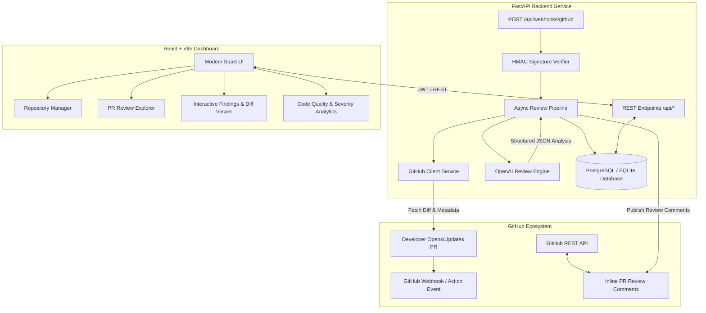

# 🚀 AI Code Review Bot

> **Automated AI-powered code reviews for every GitHub Pull Request.**

A modern, production-ready full-stack application built to analyze Pull Requests using advanced LLM reasoning, flag critical bugs, security vulnerabilities, code quality smells, and performance bottlenecks, and surface actionable recommendations directly to developers via GitHub comments and a sleek web dashboard.

---

## 🏛️ System Architecture



---

## 🛠️ Technology Stack

| Layer | Technology | Description |
|---|---|---|
| **Frontend** | React 18, Vite, Tailwind CSS, Lucide Icons, React Router DOM, Recharts, Axios | Responsive, high-performance developer dashboard |
| **Backend** | Python 3.10+, FastAPI, Pydantic v2, Uvicorn, SQLAlchemy 2.0 (Async), Alembic | High-throughput asynchronous REST API |
| **AI Reasoning** | OpenAI API (`gpt-4o`, `gpt-4o-mini`), Structured Outputs | Code diff analysis & severity categorization |
| **Database** | PostgreSQL (Production) / SQLite aiosqlite (Development) | Robust relational modeling for PRs, reviews, findings |
| **Integrations** | GitHub REST API, Webhooks, GitHub Actions CI/CD | Seamless git workflow integration |
| **Containerization** | Docker, Docker Compose | Single-command multi-service deployment |

---

## 📁 Repository Structure

```
ai-code-review-bot/
├── backend/                  # FastAPI Application
│   ├── app/
│   │   ├── api/              # API Route Handlers
│   │   │   ├── endpoints/    # Modular route controllers (health, repos, PRs, etc.)
│   │   │   └── router.py     # Central API router aggregator
│   │   ├── core/             # Application Configuration & Database Engines
│   │   │   ├── config.py     # Pydantic Settings
│   │   │   └── database.py   # SQLAlchemy async engine & sessions
│   │   ├── models/           # SQLAlchemy ORM Database Models
│   │   ├── schemas/          # Pydantic Schemas & DTOs
│   │   ├── services/         # Business logic (AI Engine, GitHub API)
│   │   └── main.py           # FastAPI Application Entrypoint
│   ├── tests/                # Pytest Test Suite
│   └── requirements.txt      # Python Dependencies
├── frontend/                 # React + Vite Application
│   ├── src/
│   │   ├── components/       # Reusable UI Components
│   │   ├── layouts/          # Dashboard & Public Layouts
│   │   ├── pages/            # View Pages (Landing, Dashboard, Repos, PRs)
│   │   ├── services/         # Axios API Client
│   │   ├── App.jsx           # Application Router
│   │   ├── index.css         # Tailwind & Custom Design Styles
│   │   └── main.jsx          # React Entrypoint
│   ├── package.json          # Node Dependencies
│   ├── tailwind.config.js    # Design System Config
│   └── vite.config.js        # Vite Bundler Config
├── .github/
│   └── workflows/            # GitHub Actions Automation
├── .env.example              # Environment Configuration Template
├── .gitignore
├── docker-compose.yml        # Multi-container orchestration
└── README.md
```

---

## 🚦 Quickstart (Phase 1 Development)

### 1. Backend Setup

```bash
cd backend
python -m venv venv
# On Windows:
.\venv\Scripts\activate
# On Linux/macOS:
source venv/bin/activate

pip install -r requirements.txt
python -m uvicorn app.main:app --reload --port 8000
```
FastAPI Swagger documentation will be available at [http://localhost:8000/docs](http://localhost:8000/docs).

### 2. Frontend Setup

```bash
cd frontend
npm install
npm run dev
```
Dashboard UI will be available at [http://localhost:5173](http://localhost:5173).
